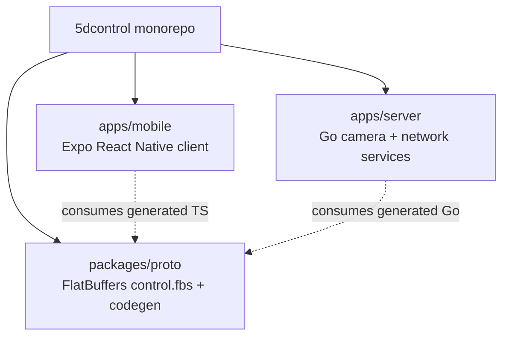

# Development guide

## Prerequisites

- Node.js + npm (workspace root)
- Go (see `go.work`) with CGO enabled for real camera builds
- libgphoto2 (real camera mode only)
- Xcode / iOS toolchain for native iOS runs; Android Studio optional (Android project not checked in yet)

## Monorepo layout



## Start the stack

```bash
# Demo mode (mock camera; no USB camera required)
npm run dev:demo

# Both apps via Turbo (real camera expected on server)
npm run dev

# Or separately
cd apps/server && npm run dev   # air hot reload
cd apps/mobile && npm run dev   # Expo
```

See [DEMO_MODE.md](./DEMO_MODE.md) for demo details.

Default endpoints (server host IP):

| Service | URL |
| --- | --- |
| WebSocket control | `ws://<ip>:8888/ws` |
| MJPEG live view | `http://<ip>:8080/live.mjpeg` |
| Preview snapshot | `http://<ip>:8080/photo.jpg` |
| Last capture (full) | `http://<ip>:8080/captures/{id}/full.jpg` (or `/captures/latest/full.jpg`) |
| Last capture (thumb) | `http://<ip>:8080/captures/{id}/thumb.jpg` |

Enter the server IPv4 on the mobile connection screen. mDNS is advertised by the server as `_5dcontrol._tcp` but the app does not browse it yet.

## Build & lint

```bash
npm run build    # proto generation then app builds
npm run lint
cd apps/server && npm run build   # bin/server
```

## Protocol changes

```bash
cd packages/proto
npm run proto    # regenerates Go + TypeScript from control.fbs
```

**Source of truth is `control.fbs`.** Do not extend behavior from stale files under `packages/proto/dist` without regenerating. Current schema: FOCUS / CAPTURE / QUERY_STATUS / QUERY_SETTINGS / QUERY_AVAILABLE_SETTINGS / SET_SETTING; Status; IMAGE_READY; CURRENT_SETTINGS; AVAILABLE_SETTINGS.

## Testing

```bash
npm test

cd apps/mobile
npm run test:unit
npm run test:integration   # expects tests under __tests__/integration (currently empty)
npm run test:coverage

cd apps/server
npm test                   # go test ./...
```

Hardware-dependent Go tests skip when libgphoto2 / camera / network are unavailable.

## Architecture pointers

Full design: [HLD.md](./HLD.md).

| Area | Start here |
| --- | --- |
| WS hub + `IMAGE_READY` + settings | `apps/server/server/ws_server.go`, `ws_settings.go` |
| MJPEG + `/captures/…` | `apps/server/server/http_server.go` |
| Real / mock camera + last-capture store | `apps/server/camera/` |
| GPhoto2 bindings | `apps/server/gphoto2/` |
| Client WS + `lastImageReady` + exposure | `apps/mobile/components/WebSocketContext.tsx` |
| Viewfinder + last-thumb + exposure pill | `apps/mobile/app/(tabs)/index.tsx`, `ExposureControls.tsx` |
| Live zoom | `apps/mobile/components/CameraStream.tsx` |
| Glass HUD | `apps/mobile/components/ViewfinderGlass.tsx` |
| Gallery review | `apps/mobile/app/gallery.tsx` |
| App grid settings (not camera exposure) | `apps/mobile/app/settings.tsx`, `SettingsContext` |

### Camera operations note

Capture and many focus paths are **synchronous/blocking** in libgphoto2. The server serializes USB work and coordinates preview pause/resume around ops. Prefer that model over inventing async completion events the camera does not reliably emit. After capture, JPEG/thumb land in the last-capture store and clients are notified via `IMAGE_READY` (HTTP for bytes).

### Capture → review (happy path)

1. Client sends `CAPTURE` over WS.
2. Server captures, caches still, broadcasts `IMAGE_READY` with HTTP paths.
3. Client GETs `/captures/{id}/full.jpg` (gallery + the viewfinder's gallery-button thumb).

`/photo.jpg` is only a live-view snapshot fallback for manual “Fetch latest” when no capture notify is available.

### Exposure settings (happy path)

1. On connect, client sends `QUERY_SETTINGS` + `QUERY_AVAILABLE_SETTINGS`.
2. Server replies with `CURRENT_SETTINGS` / `AVAILABLE_SETTINGS` (mock has realistic lists; real available lists may be empty).
3. Client sends `SET_SETTING` with field + string value; server applies via `SettingsController` on the serialized worker, then broadcasts updated `CURRENT_SETTINGS`.
4. The viewfinder ISO / TV / AV pill reflects the new values.

**App grid settings** (`settings.tsx` / `SettingsContext`) are local overlays only — keep them separate from camera exposure.
