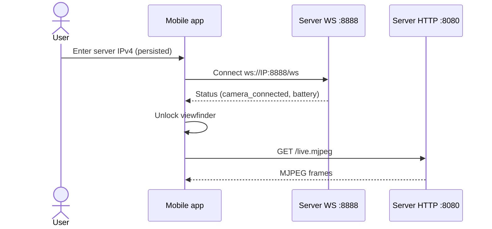
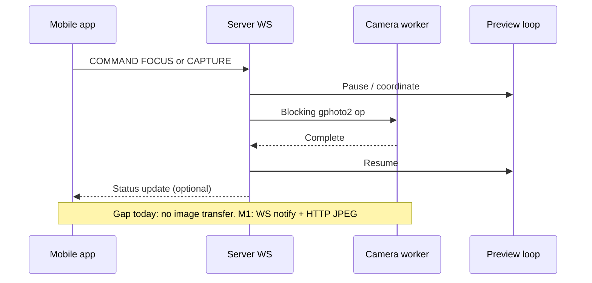
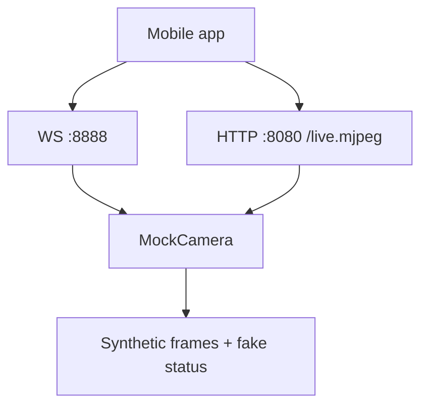

# High-level design (HLD)

## 1. Context

5DControl is a two-plane remote camera system hosted on a **travel router** (USB to camera, Wi‑Fi AP to iOS):

| Plane | Transport | Role |
| --- | --- | --- |
| Control | WebSocket `:8888/ws` | Commands + status (FlatBuffers); later: “image ready” notifies |
| Media | HTTP `:8080` | MJPEG live view (`/live.mjpeg`), still JPEG/thumbnail downloads |

The **server** owns the USB camera session (libgphoto2). The **iOS client** never talks to the camera directly. MVP camera: **Canon EOS 5D Mark III**.

```mermaid
flowchart LR
  subgraph Phone["iOS app (Expo)"]
    UI["Connection / UI"]
    WSCtx["WebSocketContext"]
    Stream["CameraStream (WebView + native zoom)"]
    Gallery["Gallery (thin HTTP cache)"]
  end

  subgraph Appliance["Travel router"]
    subgraph Server["Go server"]
      Hub["WS hub :8888"]
      HTTP["HTTP :8080"]
      Cam["CameraController"]
      Real["RealCamera (gphoto2)"]
      Mock["MockCamera (-demo)"]
      MDNS["mDNS advertise"]
      Cam --> Real
      Cam --> Mock
    end
  end

  Camera["Canon 5D Mark III"]

  WSCtx <-->|"FlatBuffers control + notifies"| Hub
  Stream < -->|"MJPEG"| HTTP
  Gallery < -->|"GET JPEG / thumbnail"| HTTP
  Hub --> Cam
  HTTP --> Cam
  Real <-->|"USB"| Camera
  MDNS -.->|"advertise; client browse TBD"| Phone
```

### Image transport decision (Expo-friendly)

**Prefer HTTP for image bytes; use WebSocket only to signal that a new image exists.**

| Approach | Expo fit |
| --- | --- |
| **HTTP GET** (`expo-image` / `Image` with URL, optional `expo-file-system` cache) | Natural: same plane as MJPEG, streaming-friendly, easy zoom/cache |
| **WS binary push** of full JPEG/RAW in FlatBuffers | Works but awkward: large messages, memory spikes, must write to disk or data-URI before display |

Recommended M1 shape:

1. Capture completes on server → cache JPEG on router.
2. WS status/event: `{ imageId, thumbUrl, fullUrl }` (or equivalent FlatBuffers fields).
3. App loads thumb/full via HTTP.

## 2. Goals & constraints

**Goals**

- Reliable exclusive access to the camera (preview vs capture/focus serialized)
- Low-friction live view suitable for composition
- Extensible binary protocol without chatty JSON for control
- Demo mode for development without hardware
- Run well on travel-router class hardware (CPU/RAM conscious)

**Constraints**

- libgphoto2 capture/focus are largely **synchronous/blocking**; architecture must not pretend they are fully event-driven
- Dual ports today (8080 media / 8888 control); mDNS currently advertises **8080 only**
- **Trusted router Wi‑Fi / LAN**; no auth/TLS in v1
- iOS-first client; Android deferred
- Protocol schema in `packages/proto/control.fbs` is intentionally minimal; generated `dist/` must not be treated as source of truth
- Single supported body for MVP: **5D Mark III**

## 3. Components

### 3.1 Mobile app (`apps/mobile`)

| Component | Responsibility |
| --- | --- |
| Expo Router screens | Connection gate → viewfinder → thin gallery → app settings |
| `WebSocketContext` | Connect, persist IP, encode/decode FlatBuffers, surface status |
| `CameraStream` | MJPEG via WebView; pinch/pan via Gesture Handler + Reanimated overlay |
| `ViewfinderGlass` | `expo-glass-effect` HUD chrome (status, nav, capture) |
| `SettingsContext` | Local-only overlays (grid) |
| Platform UI | Expo UI / SwiftUI forms for connection + app settings |

**Not yet in product surface:** exposure UI, mDNS browse, capture-notify image pipeline. Thin gallery can pull HTTP `photo.jpg` into local cache — not auto-wired after shutter.

### 3.2 Server (`apps/server`)

| Package | Responsibility |
| --- | --- |
| `server/` | HTTP MJPEG + WebSocket hub |
| `camera/` | `CameraController`, operation serialization, preview lifecycle, settings helpers, mock |
| `gphoto2/` | CGO bindings to libgphoto2 |
| `discovery/` | mDNS registration (`_5dcontrol._tcp`) |

Camera operations are serialized through a worker so preview and still/focus ops do not race on the USB session.

### 3.3 Protocol (`packages/proto`)

Source of truth: `control.fbs`.

Current messages:

- **Command:** `FOCUS`, `CAPTURE`, `QUERY_STATUS`
- **Status:** `camera_connected`, `battery_level`

Expansion for settings and images must land in `.fbs` first, then regenerate Go/TS, then wire WS handlers and UI.

## 4. Key runtime flows

### 4.1 Connect



### 4.2 Capture / focus



Single-controller policy (Mode A): only one iOS client should drive commands; additional control connections are out of policy for v1.

### 4.3 Demo mode

`go run . -demo` substitutes `MockCamera`: synthetic frames and fake battery/status so mobile UI can be developed without USB.



## 5. Cross-cutting concerns

| Concern | Current state | Direction |
| --- | --- | --- |
| Discovery | Server advertises; client does not browse | Add Bonjour/mDNS client; align advertised port with connection UX |
| Security | Trusted router Wi‑Fi / LAN; no auth v1 | Keep trust boundary at the AP |
| Observability | Server + mobile loggers | Structured logs + capture latency metrics |
| Multi-client | **Single controller** (Mode A) | Reject or ignore additional control clients; Mode B viewers deferred |
| Packaging | Local `bin/server`, EAS for mobile | Document host OS deps; release artifacts |

## 6. Quality attributes

| Attribute | Approach |
| --- | --- |
| Reliability | Exclusive camera worker; explicit completion modes for capture |
| Testability | Mock camera; Go tests; Jest unit tests; integration suite placeholder |
| Extensibility | FlatBuffers versioned schema; controller interfaces |
| Operability | `-demo`, `-bench-completion` for host-side diagnosis |

## 7. Out of scope for this HLD revision

- Hardware AP design
- Full CamRanger feature set
- Cloud sync backends

Those belong in product/roadmap decisions, not in the current runtime contract.
