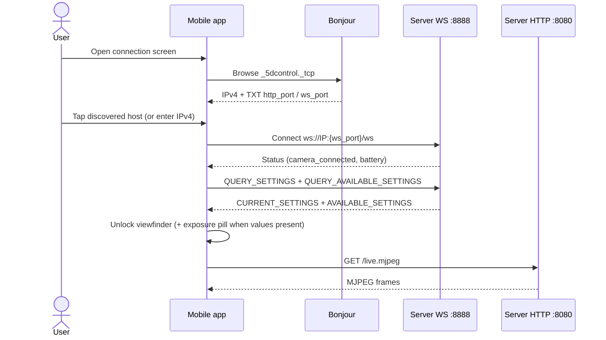
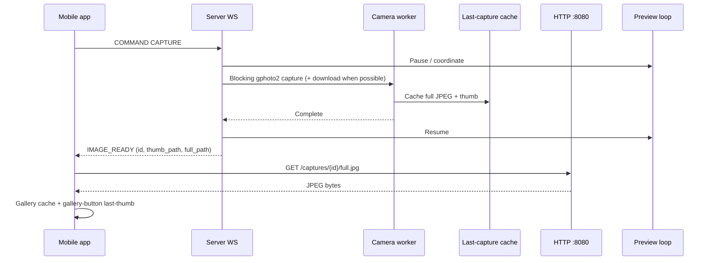
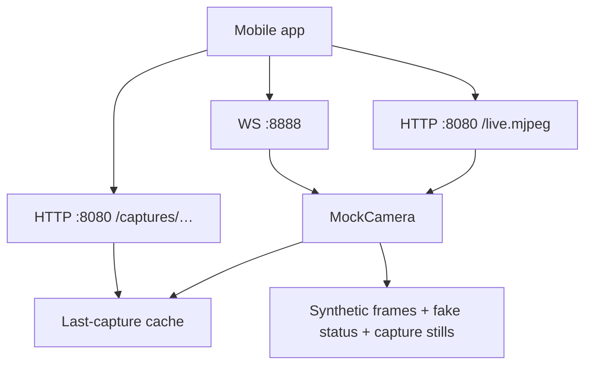

# High-level design (HLD)

## 1. Context

5DControl is a two-plane remote camera system hosted on a **travel router** (USB to camera, Wi‑Fi AP to iOS):

| Plane | Transport | Role |
| --- | --- | --- |
| Control | WebSocket `:8888/ws` | Commands + status + `IMAGE_READY` + exposure settings (FlatBuffers) |
| Media | HTTP `:8080` | MJPEG live view (`/live.mjpeg`), preview snapshot (`/photo.jpg`), last-capture stills (`/captures/…`) |

The **server** owns the USB camera session (libgphoto2). The **iOS client** never talks to the camera directly. MVP camera: **Canon EOS 5D Mark III**.

```mermaid
flowchart LR
  subgraph Phone["iOS app (Expo)"]
    UI["Connection / UI"]
    WSCtx["WebSocketContext"]
    Stream["CameraStream (WebView + native zoom)"]
    Gallery["Gallery + last-thumb"]
  end

  subgraph Appliance["Travel router"]
    subgraph Server["Go server"]
      Hub["WS hub :8888"]
      HTTP["HTTP :8080"]
      Cam["CameraController"]
      Store["Last-capture cache"]
      Real["RealCamera (gphoto2)"]
      Mock["MockCamera (-demo)"]
      MDNS["mDNS advertise"]
      Cam --> Real
      Cam --> Mock
      Cam --> Store
    end
  end

  Camera["Canon 5D Mark III"]

  WSCtx <-->|"FlatBuffers control + IMAGE_READY + settings"| Hub
  Stream < -->|"MJPEG"| HTTP
  Gallery < -->|"GET /captures/{id}/…"| HTTP
  Hub --> Cam
  HTTP --> Cam
  HTTP --> Store
  Real <-->|"USB"| Camera
  MDNS -.->|"advertise _5dcontrol._tcp + TXT ports"| Phone
```

### Image transport decision (Expo-friendly)

**Prefer HTTP for image bytes; use WebSocket only to signal that a new image exists.**

| Approach | Expo fit |
| --- | --- |
| **HTTP GET** (`expo-image` / `Image` with URL, optional `expo-file-system` cache) | Natural: same plane as MJPEG, streaming-friendly, easy zoom/cache |
| **WS binary push** of full JPEG/RAW in FlatBuffers | Works but awkward: large messages, memory spikes, must write to disk or data-URI before display |

**Shipped M1 shape:**

1. Capture completes on server → cache JPEG (+ thumb) on the host/router.
2. WS `IMAGE_READY`: `{ image_id, thumb_path, full_path }` (HTTP paths on `:8080`).
3. App loads thumb/full via HTTP (`/captures/{id}/thumb.jpg`, `/captures/{id}/full.jpg`).

`/photo.jpg` remains a **live-view preview snapshot**, not the last capture.

## 2. Goals & constraints

**Goals**

- Reliable exclusive access to the camera (preview vs capture/focus serialized)
- Low-friction live view suitable for composition
- Extensible binary protocol without chatty JSON for control
- Demo mode for development without hardware
- Run well on travel-router class hardware (CPU/RAM conscious)

**Constraints**

- libgphoto2 capture/focus are largely **synchronous/blocking**; architecture must not pretend they are fully event-driven
- Dual ports today (8080 media / 8888 control); mDNS SRV is HTTP `:8080`, TXT carries `http_port` + `ws_port`
- **Trusted router Wi‑Fi / LAN**; no auth/TLS in v1
- iOS-first client; Android deferred
- Protocol schema in `packages/proto/control.fbs` is intentionally minimal; generated `dist/` must not be treated as source of truth
- Single supported body for MVP: **5D Mark III**

## 3. Components

### 3.1 Mobile app (`apps/mobile`)

| Component | Responsibility |
| --- | --- |
| Expo Router screens | Connection gate → viewfinder → gallery → app settings |
| `WebSocketContext` | Connect, persist IP + ports, encode/decode FlatBuffers, surface status + `lastImageReady` + camera exposure |
| `CameraStream` | MJPEG via WebView; pinch/pan via Gesture Handler + Reanimated overlay; tap for focus |
| `ViewfinderGlass` | `expo-glass-effect` HUD chrome (status, nav, capture) |
| `ConnectionHud` | Wifi pill → reconnect / disconnect (return to connection screen) |
| `ExposureControls` | Bottom ISO / TV / AV readout pill + expanding value rail (camera exposure, not app settings) |
| Viewfinder last-thumb | After `IMAGE_READY`, download still and show it as the gallery button artwork |
| Gallery | Auto-fetch on notify; manual fetch; local `expo-file-system` / `expo-image` cache |
| `SettingsContext` / `settings.tsx` | **App-only** overlays (grid) — not camera ISO/Tv/Av |
| Platform UI | Expo UI / SwiftUI forms for connection + app settings; Bonjour nearby-server list on iOS |

**Not yet in product surface:** live 5D III AF-point selection (tap reticle + coords are wired; body still uses center AF drive). Capture-notify and exposure settings are wired on the demo/sim path; verified under ~3s capture→thumb on travel-router Wi‑Fi with 5D III remains a live-bench exit criterion. Real gphoto2 available-choice enumeration still returns empty lists.

### 3.2 Server (`apps/server`)

| Package | Responsibility |
| --- | --- |
| `server/` | HTTP MJPEG + capture routes + WebSocket hub (`IMAGE_READY` + settings broadcast) |
| `camera/` | `CameraController`, `SettingsController`, last-capture store, operation serialization, preview, mock |
| `gphoto2/` | CGO bindings (capture path + file download) |
| `discovery/` | mDNS advertise `_5dcontrol._tcp` (SRV = HTTP port; TXT `http_port` / `ws_port` / `version`) |

Camera operations are serialized through a worker so preview and still/focus ops do not race on the USB session. After a successful capture, the server caches JPEG/thumb and notifies WS clients.

### 3.3 Protocol (`packages/proto`)

Source of truth: `control.fbs`.

Current messages:

- **Command:** `FOCUS`, `CAPTURE`, `QUERY_STATUS`, `QUERY_SETTINGS`, `QUERY_AVAILABLE_SETTINGS`, `SET_SETTING`
  - `SET_SETTING` carries `setting_field` (`ISO` / `SHUTTER_SPEED` / `APERTURE` / `EXPOSURE_COMPENSATION`) + `setting_value` (string)
  - `FOCUS` may include `has_focus_point` + normalized `focus_x` / `focus_y` (0–1 viewfinder space). Demo mock logs the point. Live 5D III still runs the existing center AF drive.
- **Status:** `camera_connected`, `battery_level`
- **ImageReady:** `image_id`, `thumb_path`, `full_path` (HTTP paths on `:8080`; client prepends `http://{ip}:8080`)
- **CurrentSettings:** `shutter_speed`, `aperture`, `iso`, `exposure_compensation`
- **AvailableSettings:** string lists for shutter / aperture / ISO / EC choices

Exposure rides FlatBuffers over WS (same plane as FOCUS/CAPTURE), not HTTP. After a successful `SET_SETTING`, the server broadcasts updated `CURRENT_SETTINGS`. Mock camera returns realistic choice lists; real camera can get/set config strings but `GetAvailableSettings` still returns empty lists until gphoto2 enumeration is finished.

Further protocol expansion must land in `.fbs` first, then regenerate Go/TS, then wire WS handlers and UI.

## 4. Key runtime flows

### 4.1 Connect



### 4.2 Capture → review



Single-controller policy (Mode A): only one iOS client should drive commands; additional control connections are out of policy for v1.

### 4.3 Change exposure (ISO / Tv / Av)

```mermaid
sequenceDiagram
  participant App as Mobile app
  participant WS as Server WS
  participant Cam as SettingsController

  App->>WS: COMMAND QUERY_SETTINGS
  WS->>Cam: GetCurrentSettings
  Cam-->>WS: current values
  WS-->>App: CURRENT_SETTINGS
  App->>WS: COMMAND QUERY_AVAILABLE_SETTINGS
  WS->>Cam: GetAvailableSettings
  Cam-->>WS: choice lists (mock; real often empty)
  WS-->>App: AVAILABLE_SETTINGS
  App->>WS: COMMAND SET_SETTING (field + value)
  WS->>Cam: SetISO / SetShutterSpeed / SetAperture / …
  Cam-->>WS: ok
  WS-->>App: CURRENT_SETTINGS (broadcast)
```

The control is non-modal by design: a glass pill docked in the bottom thumb zone reads out ISO / TV / AV, and tapping a segment expands a horizontal rail that snaps through that field's `AVAILABLE_SETTINGS` list. `SET_SETTING` is sent when the rail settles, so scrubbing does not flood the serialized camera worker. Exposure values are enumerated, not continuous — the rail maps one detent per choice.

### 4.4 Tap-to-focus

Tapping the live view (not a pinch/pan) places `FocusIndicator` at the tap and sends `FOCUS` with normalized 0–1 coords. Long-pressing the shutter still focuses without a point (center). Demo mock acknowledges and logs the point. The 5D III USB path does not yet select an AF point on the body — it runs the existing AF drive after logging the coords.

### 4.5 Demo mode

`go run . -demo` substitutes `MockCamera`: synthetic MJPEG, fake battery/status, labeled stills after shutter, and mutable exposure settings with realistic available lists — so capture→gallery and ISO/Tv/Av flows work without USB.



## 5. Cross-cutting concerns

| Concern | Current state | Direction |
| --- | --- | --- |
| Discovery | Server advertises `_5dcontrol._tcp`; iOS browses (dev client). SRV = HTTP; TXT has both ports | Keep manual IP as fallback; Android browse deferred |
| Security | Trusted router Wi‑Fi / LAN; no auth v1 | Keep trust boundary at the AP |
| Observability | Server + mobile loggers | Structured logs + capture latency metrics |
| Multi-client | **Single controller** (Mode A) | Reject or ignore additional control clients; Mode B viewers deferred |
| Packaging | Local `bin/server`, EAS for mobile | Document host OS deps; release artifacts |

## 6. Quality attributes

| Attribute | Approach |
| --- | --- |
| Reliability | Exclusive camera worker; explicit completion modes for capture |
| Testability | Mock camera; Go tests; Jest unit tests; integration suite placeholder |
| Extensibility | FlatBuffers versioned schema; controller interfaces |
| Operability | `-demo`, `-bench-completion` for host-side diagnosis |

## 7. Out of scope for this HLD revision

- Hardware AP design
- Full CamRanger feature set
- Cloud sync backends

Those belong in product/roadmap decisions, not in the current runtime contract.
