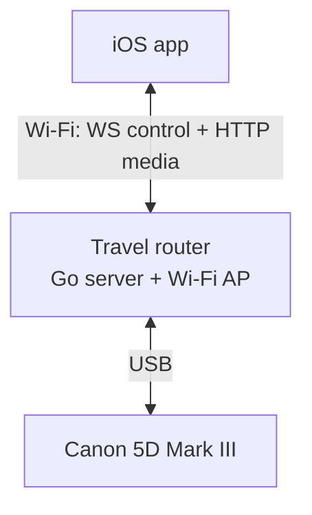
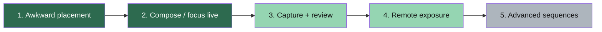

# Product vision & competitive parity

## What 5DControl is

5DControl is a **CamRanger-like camera remote appliance** built from:

- A **travel router with USB** plugged into the camera (hosts the Go server + Wi‑Fi AP)
- An **iOS Expo app** for live view, focus, capture, review, and remote exposure settings (demo/sim wired)
- A thin **FlatBuffers** control protocol over WebSocket, plus **HTTP** for MJPEG live view and still downloads

The photographer joins the router’s network and controls a **Canon EOS 5D Mark III**. This is a personal project; store distribution and desktop clients are deferred.

## Locked product decisions

| Decision | Choice |
| --- | --- |
| Supported body (MVP) | Canon EOS **5D Mark III** only |
| Form factor | Travel-router appliance (USB to camera, Wi‑Fi to phone) |
| Mobile platform | **iOS first**; Android later |
| Image transport | **HTTP for JPEG/thumbnails** + WS notify (see HLD); easiest with Expo |
| Camera brands | Canon only for now |
| Distribution | Personal / internal; public store deferred |
| Security | Trusted LAN / router AP; no auth for v1 |
| Desktop companion | Deferred |
| Positioning | Appliance via travel router — **not** “BYO computer” |
| Multi-client | **Single controller** (one iOS device); Mode B viewers deferred |

**All product open questions from the docs pass are closed.**

## Primary jobs to be done

1. Place the camera where the photographer cannot stand behind it.
2. Compose and focus via live view on a phone/tablet.
3. Trigger capture and immediately review results on the same device.
4. Adjust exposure settings remotely without walking back to the camera.
5. Support advanced sequences (bracketing, intervalometer, focus stacking) for studio/macro/landscape workflows.

Today we reliably deliver **(1)** and **(2)** (live view + focus/capture). **(3)** is productized on the demo/sim path (WS `IMAGE_READY` → HTTP still → gallery/last-thumb); live 5D III timing on travel-router Wi‑Fi still needs bench validation. **(4)** is productized on the demo/sim path (WS exposure settings + the viewfinder exposure pill); live available-choice enumeration is still open. **(5)** is not productized yet.

Green = done · Light green = partial (sim done / live bench or enumeration open) · Gray = not productized.

## Competitive reference: CamRanger-class parity

Targets use CamRanger 2 as the professional baseline. Status is relative to **5DControl today**.

| Capability | CamRanger 2 | 5DControl today | Parity priority |
| --- | --- | --- | --- |
| Live view stream | Yes | Yes (MJPEG) | Maintain |
| Remote capture | Yes | Yes | Maintain |
| Focus (touch / incremental) | Touch + incremental | Center AF trigger only | P0 |
| Camera settings remote (ISO/Tv/Av/WB/…) | Broad | Demo/sim wired over WS + viewfinder; live available-lists TBD | P0 |
| Post-capture image review + zoom | Full-res up to 200% | Gallery + fullscreen review via HTTP stills after `IMAGE_READY` | P0 |
| Auto thumbnails after capture | Yes | Yes (gallery-button last-thumb + gallery auto-fetch; live timing bench open) | P0 |
| Grid / composition overlays | Many | Rule-of-thirds + golden ratio | P1 |
| Histogram / blinkies / EXIF overlay | Yes | Not started | P1 |
| Client discovery | Own Wi‑Fi AP | Server mDNS only; manual IP in app | P0 |
| Multi-brand cameras | Canon/Nikon/Sony/Fuji | **5D Mark III only** | Deferred |
| HDR / exposure bracketing | Advanced | Not started | P1 |
| Intervalometer / time-lapse | Yes | Not started | P1 |
| Focus stacking | Yes | Not started | P2 |
| Video start/stop + review | Yes | Not started | P2 |
| Save images to device library | Yes | Not started | P1 |
| Multi-device share / live view | CamRanger Share | **Single controller** (Mode A) | Deferred |
| Cloud / FTP / social upload | Yes | Not started | Out of scope |
| Desktop clients | Yes | Deferred | Deferred |
| Android + iOS | Yes | **iOS first** | Android later |
| Appliance Wi‑Fi | Dedicated hardware AP | **Travel router AP + USB** | Build toward |
| Auth / TLS | Closed AP model | Trusted LAN; no auth v1 | Accepted for v1 |
| Motorized pan/tilt | Optional hardware | Out of scope | Out of scope |

**MVP parity:** CamRanger daily-use core on **5D Mark III** via the travel-router appliance — live view, reliable focus, exposure control, capture, and immediate JPEG review on **iOS**.

## Non-goals (near term)

- Public App Store / Play Store release
- Desktop companion
- Nikon/Sony/Fuji
- Android in M1–M3
- Auth/TLS on the router AP
- Multi-controller or live-view viewers (Mode B+)
- Proprietary long-range radio (router Wi‑Fi is the link)

## Success metrics (draft)

| Metric | Target once MVP ships |
| --- | --- |
| Time from open app → live view | < 15 s on the router Wi‑Fi with discovery |
| Capture → thumbnail visible | < 3 s typical JPEG on 5D Mark III |
| Live view usable latency | Subjectively “shootable”; measure p95 frame age |
| Focus success rate (5D III) | > 95% of presses produce AF attempt without killing preview |
| Demo mode | Full happy-path without hardware for CI and onboarding |
