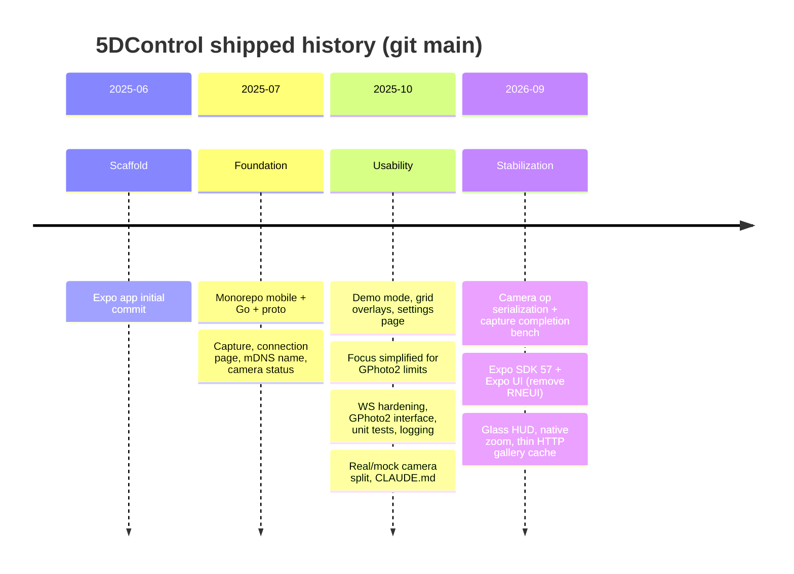
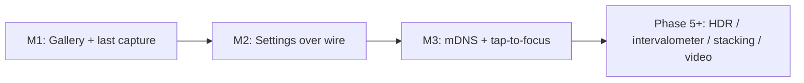
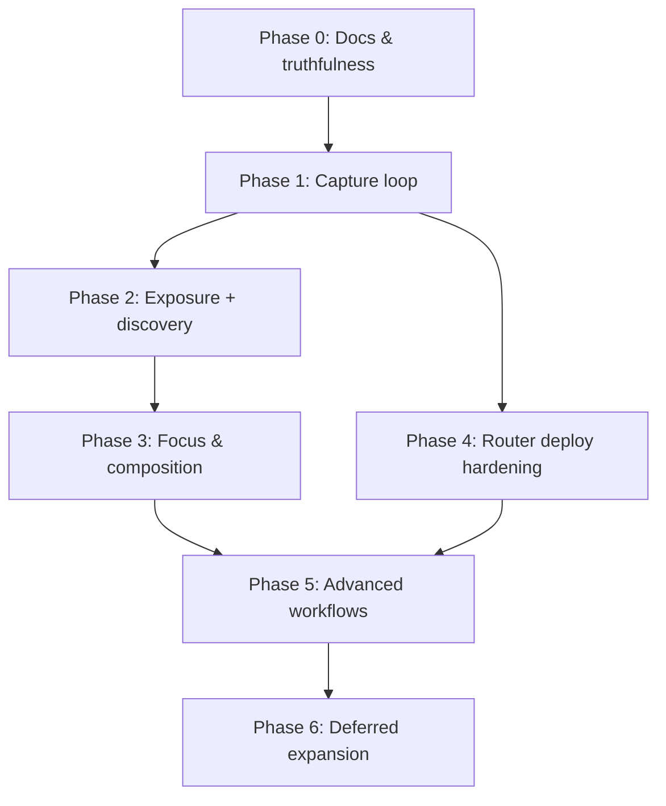
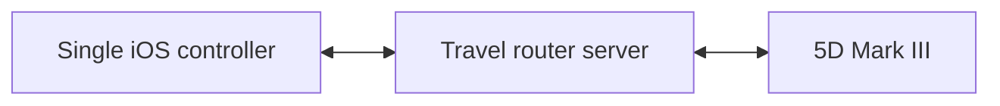

# Roadmap

This roadmap combines **what git history shows we already shipped** with **what remains for CamRanger-class daily-use parity** on a **Canon 5D Mark III** via a **travel-router appliance**. Dates are from commit history on `main`.

## Timeline of what we have done

### Shipped capability themes (evidence-based)

| When | Theme | Representative commits |
| --- | --- | --- |
| 2025-06 → 07 | Foundation | monorepo, capture, connection, status, mDNS naming |
| 2025-10 | Usability + reliability | demo mode, grids, settings, focus/GPhoto2 hardening, tests, logging |
| 2026-09 | Stabilization + Expo 57 polish | serialize camera ops, Expo UI, glass HUD, native zoom, thin gallery |

### Explicitly not shipped (code + docs evidence)

- Full capture→review loop (WS image-ready notify + reliable last-capture pull from card)
- End-to-end camera exposure settings (ISO/Tv/Av) over WebSocket + UI
- Mobile mDNS/Bonjour discovery (server advertises only)
- Auth/TLS
- Android checked-in native project / CI workflows
- Advanced sequences: HDR, intervalometer, focus stacking, video

**Partial:** iOS gallery can fetch `photo.jpg` over HTTP into local `expo-file-system` / `expo-image` cache — Phase 1 still owns the real post-capture notify path.

---

## Proposed phases

Priorities map to [PRODUCT.md](./PRODUCT.md) P0–P3.

### Phase 0 — Docs & truthfulness *(this change)*

- Accurate README, HLD, roadmap, demo guide
- Treat `control.fbs` as protocol source of truth; call out generated `dist/` drift
- Keep agent docs (`CLAUDE.md`) aligned with reality

### Phase 1 — Close the capture loop (P0) — *MVP parity core*

**Goal:** After pressing shutter, the photographer can review the frame on iOS.

1. Extend protocol with image-ready notify (id + HTTP URLs); serve thumb + full JPEG over HTTP
2. Server: download/cache last capture from 5D Mark III card (or host cache on the router)
3. Mobile: wire the existing gallery route to capture-notify; thumbnail strip after capture; pinch-zoom review (`expo-image` / file cache already partial)
4. Wire or remove orphan UI (`CaptureButton`, `FocusIndicator`, etc.)

**Exit criteria:** Capture → thumbnail &lt; ~3s (JPEG) on 5D Mark III over the travel-router Wi‑Fi.

### Phase 2 — Remote exposure + discovery (P0)

1. Expose `SettingsController` over WS (current + available values)
2. Mobile exposure controls on viewfinder
3. Finish gphoto2 choice enumeration (today returns empty available lists)
4. Mobile mDNS browse of `_5dcontrol._tcp`; clarify which port clients should use
5. Disconnect / reconnect UX on the viewfinder

**Exit criteria:** Change ISO/Tv/Av without leaving live view; connect without typing IP on same LAN.

### Phase 3 — Focus & composition quality (P0/P1)

1. Tap-to-focus (reuse unused focus indicator positioning)
2. Incremental focus if supported by body
3. Live-view overlays: histogram / highlight warning (beyond grids)
4. Preview zoom quality pass (already partial)

### Phase 4 — Platform & hardening (P1)

1. Keep iOS path solid (network entitlements for discovery on router Wi‑Fi)
2. Document travel-router deploy (arch, libgphoto2, USB permissions, AP setup)
3. Android / CI / EAS public tracks stay deferred for this personal project
4. Auth/TLS remain out of scope while the router AP is the trust boundary

### Phase 5 — Advanced workflows (P1/P2) — CamRanger “pro” features

Order TBD by persona (still Canon 5D III only):

- Intervalometer / bulb
- HDR / exposure bracketing
- Focus stacking
- Save to camera roll
- Video record start/stop

### Phase 6 — Expansion (deferred)

- Android
- Desktop companion
- Multi-client viewers (if chosen)
- Other Canon bodies / brands
- Public store listing

---

## Near-term suggested sequence (next 3 milestones)

| Milestone | Outcome |
| --- | --- |
| M1 | HTTP JPEG serve + WS notify; iOS gallery MVP on 5D III |
| M2 | Settings over the wire + viewfinder controls |
| M3 | mDNS connect on router Wi‑Fi + tap-to-focus |

Everything in Phase 5+ waits until M1–M3 feel trustworthy on the travel-router + 5D Mark III setup.

### Phase dependency overview

---

## Product decisions (locked)

| Topic | Decision |
| --- | --- |
| Supported body | Canon EOS **5D Mark III** |
| Form factor | Travel router with USB → CamRanger-like appliance |
| Platforms | **iOS first**; Android later |
| Image transport | **HTTP** for JPEG/thumbs; **WS** for image-ready notify (Expo-friendly) |
| Brands | Canon only for now |
| Distribution | Personal project; store deferred |
| Security | Trusted router LAN/AP; no auth v1 |
| Desktop | Deferred |
| Positioning | Appliance via travel router (not BYO laptop messaging) |
| Multi-client | **A — single controller** for now (one phone controls; no viewers) |

## Multi-client policy

**Locked: Mode A — single controller.**

Exactly one connected iOS client may send FOCUS / CAPTURE / settings and consume live view + gallery. Extra simultaneous controllers are out of scope; optional read-only viewers (Mode B) may be revisited later.

